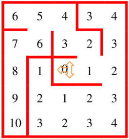

# MicroMouseSimulation
Simulación de un Micro-Mouse que resuelve un laberinto usando el algoritmo de inundación o Flood-Fill. Desarrollado en Processing.

## ¿Cómo funciona?

El objetivo principal del micro-mouse es llegar al punto solución o llegada, desde cualquier esquina del laberinto.

Usando el algoritmo de inundación, le permite al Micro Mouse resolver el laberinto. El algoritmo de inundación esta basado en funciones Heurísticas (Árbol de búsqueda) en cada celda del laberinto (8x8), con el objetivo de conocer la distancia que se encuentra el micro-mouse al punto de llegada.

El laberinto se basa en dividir el laberinto en celdas (8x8 = 64 celdas), los valores se calculan desde el punto de llegada en el centro que vale 0 (imagen-1: celda color azul), en seguida, los campos o celdas adyacentes de la meta, ya sea horizontal o vertical, tendrán un valor de 1 (primer nivel), las celdas adyacentes del primer nivel tendrán un valor de 2 (segundo nivel), los campos adyacentes del segundo nivel tendrán un valor de 3 (tercer nivel) y así sucesivamente (imagen-1).

Para empezar el algoritmo Flood-Fill se debe conocer la dimensión del laberinto y el punto objetivo o llegada.

El termino inundación se conoce por que precisamente se encarga de "inundar" el laberinto, como si se vertiera agua desde el punto solución, a través de los diferentes niveles.

## Ejemplo: comportamiento del Algoritmo Flood-Fill

Se mostrará paso a paso el funcionamiento del Algoritmo de inundación.

1. El micro-mouse empieza en la esquina inferior izquierda, como se muestra en la imagen-2 y según las reglas de competencia, la primera celda debe tener solo un camino en dirección al norte del robot o micro-mouse.

2. El robot avanza a la siguiente celda, comprueba que el valor adyacente a otra celda sea menor y no tenga muro. En este caso es hacia el norte (imagen-3).

3. El micro-mouse no tiene celdas adyacentes menores visibles, así que se calcularán los valores de las celdas que ha pasado el robot. (imagen-4)

4. Con la inundación se calcula el valor de la celda actual (haciendo que la anterior sea cada vez mayor) y ahora es posible seguir avanzando, ya que el campo norte es menor al actual. (imagen-5)

5. El micro-mouse se encuentra con un muro al norte, pero tiene un campo visible a la derecha y con un valor menor al actual, así que puede girar a la derecha. (imagen-6)

6. El robot se encuentra con un obstáculo en su camino y solo cuenta con una celda visible hacia su izquierda, el dato del campo es mayor al actual. (imagen-7)

7. Se calculan los nuevos valores de los campos recorridos, el valor de la celda de la izquierda ya es menor al actual, continua con su ruta. (imagen-8)

8. El robot siempre va ha escoger la celda menor a la actual, siempre y cuando tenga dos opciones o caminos, en el caso de la siguiente imagen la mejor opción es girar hacia la derecha. (imagen-9)

9. Continuando con la lógica, el siguiente giro es hacia la derecha. (imagen-10)

10. La única salida es a la izquierda, pero el dato es mayor al actual, así que se inunda nuevamente el laberinto. (imagen-11)

11. Después de actualizar los valores, se procede a girar hacia la izquierda. (imagen-12).

12. La única ruta visible es a la derecha y el dato es menor. (imagen-13)

13. Escoge nuevamente la celda con valor menor, con destino a la meta. (imagen-14)

14. Gira a la derecha y llega a la celda destino = 0. (imagen-15)

## Simulación en acción

Usando la lógica anterior, se mostrará la simulación del micro-mouse en Processing en la siguiente imagen. El procedimiento de encontrar la ruta más corta consiste en dos pasos:

1. El analisis o aprendizaje del laberinto.
2. Después de haber aprendido, desde el punto de partida escoge la ruta más corta y rápida hacia la solución (punto de llegada) del laberinto.

### Comentario

Si llego hasta aquí, siéntase libre de mejorar el código o copiarlo. :D
